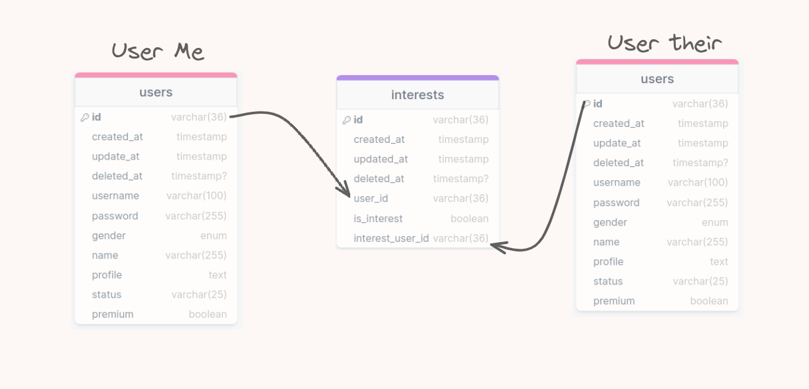

# Dealls Job Interview
Backend system for a simple dating app. The system is built using Golang and PostgreSQL.

## Prerequisites
- Golang version 1.21 or higher
- PostgreSQL
- Docker
- Docker Compose
- Makefile
- Golang Migrate
- Golang Mockery
- Buf Protoc
- Go Cron
- Golang Testify

## ERD Diagram

